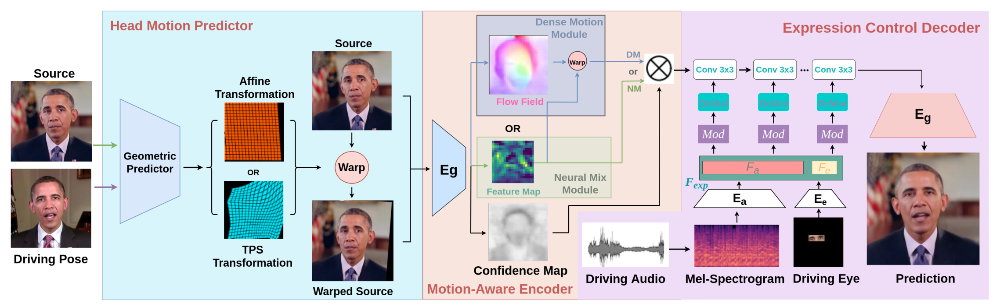

# Abstract

For realistic talking head generation, creating natural head motion while maintaining accurate lip synchronization is essential. To fulfill this challenging task, we propose DisCoHead, a novel method to disentangle and control head pose and facial expressions without supervision. DisCoHead uses a single geometric transformation as a bottleneck to isolate and extract the head motion from a head-driving video. Either affine or thin-plate spline can be used and works well as a geometric transformation. We enhance the efficiency of DisCoHead by integrating dense motion estimator and the encoder of generator which were originally separate modules. Taking a step further, we also propose a neural mixing where dense motion is estimated and applied implicitly by the encoder. After applying the disentangled head motion to a source identity, DisCoHead controls the mouth region according to speech audio, and it blinks eyes and moves eyebrows following a separate driving video of the eye region, via weight modulation of convolutional neural networks. The experiments using multiple datasets show that DisCoHead successfully generates realistic audio-and-video-driven talking heads and outperforms state-of-the-art methods.
<br><br>

# Architecture

<br><br>

# Demo Videos

## Obama 

<center>
    <!-- <iframe width="640" height="360" src="assets/videos/SampleVideo_1280x720_1mb.mp4" frameborder="0"> </iframe><br> -->
    <video controls preload="auto" width="640" height="320">
        <source src="assets/demos/fig2-font_.mp4" type="video/mp4">
    </video>
    <br>
    Cumulative control of head pose, lip movements, and eye expressions by different drivers (Fig. 2)
</center>
<!-- Fig.2. from original paper. It visualizes disentangled control of head pose, lip movements and eye expressions on the Obama dataset. Head pose, lip movements, eye expressions are sequentially added to source image each following different driving video. Detailed expressions such as blinking eyes and raising eyebrows are elegantly transferred to the source image. -->
<br>

<center>
    <!-- <iframe width="640" height="360" src="assets/videos/SampleVideo_1280x720_1mb.mp4" frameborder="0"> </iframe><br> -->
    <video controls preload="auto" width="920" height="240">
        <source src="assets/demos/obama_demo_.mp4" type="video/mp4">
    </video>
    <br>
    Separate control of head motion, lip synchronization, and eye expressions by a single driver and their combination
</center>
<!-- Demo video from Obama dataset. DiscoHead can control specific components of source image to make it follow driving video. In the above eyes only driving video, eye expressions, eyebrows, and even wrinkles of forehead are correctly transferred to source image. This video shows DiscoHead’s ability to control single components among head pose, lip movements, and eye expressions while other components fixed. -->
<br>
<br>

## GRID 

<center>
    <!-- <iframe width="640" height="360" src="assets/videos/SampleVideo_1280x720_1mb.mp4" frameborder="0"> </iframe><br> -->
    <video controls preload="auto" width="554" height="300">
        <source src="assets/demos/grid12_.mp4" type="video/mp4">
    </video>
    <br>
    Identity preservation and faithful transfer of head pose and facial expressions from a single driver (Fig. 3)
</center>
<!-- Fig.3. from original paper. Qualitative results on the GRID dataset.  Driver's lip movements, eye expressions are correctly transferred to source image while preserving source identity's original characteristics(eyes & lips appearance and motions, degree to close one's eyes and lips, positions of wrinkles and beards, direction of eye gaze,  location of eyebrows, etc.). This video shows DiscoHead's ability to maintain source identity's characteristics in highly detailed manner. -->
<br>

<center>
    <!-- <iframe width="640" height="360" src="assets/videos/SampleVideo_1280x720_1mb.mp4" frameborder="0"> </iframe><br> -->
    <video controls preload="auto" width="640" height="320">
        <source src="assets/demos/grid22_.mp4" type="video/mp4">
    </video>
    <br>
    Identity preservation and faithful transfer of head pose and facial expressions from multiple drivers
</center>
<!-- Demo video from GRID dataset. Head motion, eyes expressions, lip movements from different identity are accurately transferred to source image. DiscoHead can drive head motion, eyes expressions, lip movements from different identity, regardless of driver's sex, appearance(glasses, skin color, hair length) or voice tone. -->
<br>
<br>

## KoEBA 

<center>
    <!-- <iframe width="640" height="360" src="assets/videos/SampleVideo_1280x720_1mb.mp4" frameborder="0"> </iframe><br> -->
    <video controls preload="auto" width="640" height="320">
        <source src="assets/demos/koeba1_.mp4" type="video/mp4">
    </video>
    <br>
    Identity preservation and faithful transfer of head motion and facial expressions from a single driver (Fig. 4)
</center> 
<!-- Fig.4. from original paper. Qualitative results on the KoEBA dataset. Driving video’s head motion, lip movements, and eye expressions are elegantly transferred to source images from different videos. Concretely, eyes getting smaller and wider magically drive source image. -->
<br>

<center>
    <video controls preload="auto" width="720" height="400">
        <source src="assets/demos/koeba23_.mp4" type="video/mp4">
    </video>
    <br>
    Identity preservation and faithful transfer of head motion and facial expressions from multiple drivers
</center> 
<!-- Demo video from KoEBA dataset. This video shows DiscoHead's ability to arbitrarily control head pose, lip movements, eye expressions of source image to follow driving videos of different identities. Regardless of different characteristics of arbitrary identity, DiscoHead succintly extracts appropriate information from driving videos and use these identity-agnostic representation to transfer it into source image while preserving source image's detailed characteristics -->
<br>
<b>Note:</b> The Korean election broadcast addresses dataset (KoEBA) is publicly available at <https://github.com/deepbrainai-research/koeba>.
<br>
<br>

# Code 

<center>
    <figure>
        <a href="https://github.com/deepbrainai-research/discohead">
            
        </a>
    </figure>
    <!-- <a href="https://github.com/deepbrainai-research/discohead">Code</a> -->
</center>
<br><br>


# Acknowledgements

This work was supported by the Institute of Information & Communications Technology Planning & Evaluation (IITP) grant funded by the Ministry of Science and ICT (MSIT) of South Korea (No. 2021-0-00888).
<br><br>


# Citation
```
To be updated
```