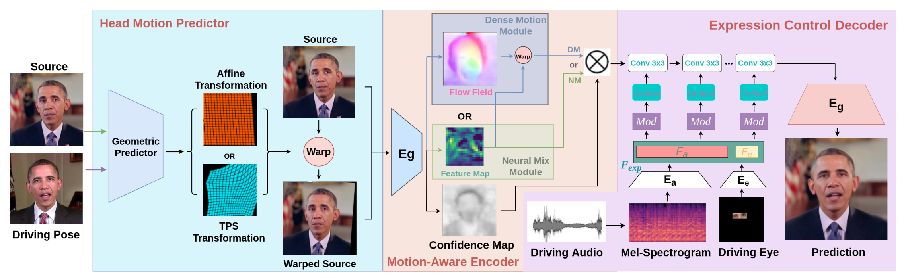

 

# Abstract 
For realistic talking head generation, creating natural head motion while maintaining accurate lip synchronization is essential. To fulfill this challenging task, we propose DisCoHead, a novel method to disentangle and control head pose and facial expressions without supervision. DisCoHead uses a single geometric transformation as a bottleneck to isolate and extract the head motion from a head-driving video. Either affine or thin-plate spline can be used and works well as a geometric transformation. We enhance the efficiency of DisCoHead by integrating dense motion estimator and the encoder of generator which were originally separate modules. Taking a step further, we also propose a neural mixing where dense motion is estimated and applied implicitly by the encoder. After applying the disentangled head motion to a source identity, DisCoHead controls the mouth region according to speech audio, and it blinks eyes and moves eyebrows following a separate driving video of the eye region, via weight modulation of convolutional neural networks. The experiments using multiple datasets show that DisCoHead successfully generates realistic audio-and-video-driven talking heads and outperforms state-of-the-art methods.

# Fill in the blank... 
blah blah...

# Acknowledgement
This work was supported by the Institute of Information & Communications Technology Planning & Evaluation (IITP) grant funded by the Ministry of Science and ICT (MSIT) of South Korea (No. 2021-0-00888).

# Noah Test

    <!-- <iframe width="640" height="360" src="assets/videos/SampleVideo_1280x720_1mb.mp4" frameborder="0"> </iframe>  -->
    <video controls preload="auto" width="640" height="360">
        <source src="assets/videos/grid_paper_test1.mp4" type="video/mp4">
    </video> 
    Something Video Test  

     
    Something Image Test   

|---|---|---|
||||

Image Test by default table

줄이 생겨버리네

# Materials 

    <figure>
        
    </figure>
    <a href="https://www.google.com">Paper</a>

  
